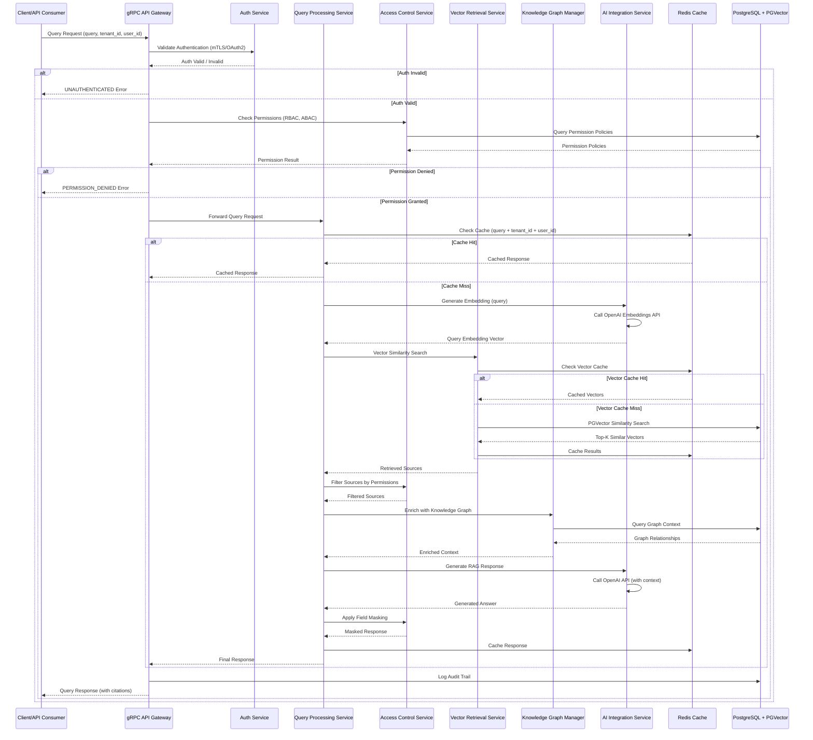
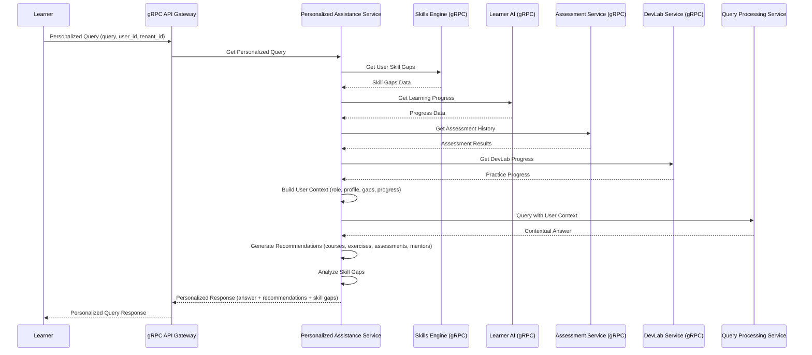
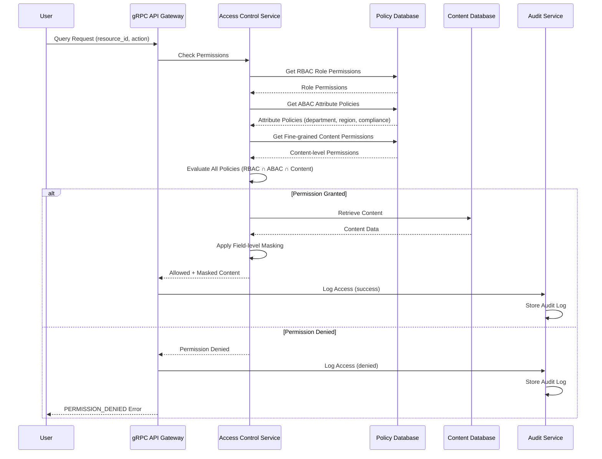
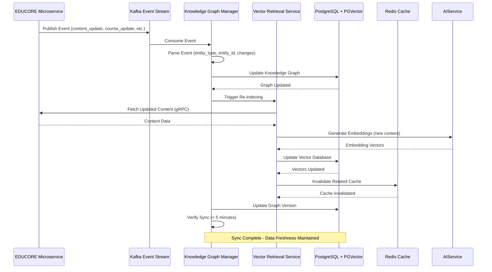
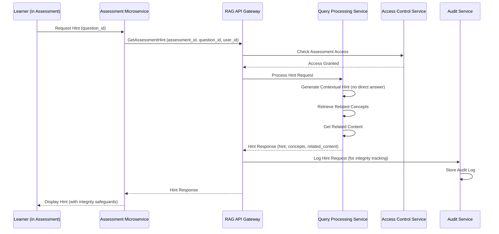
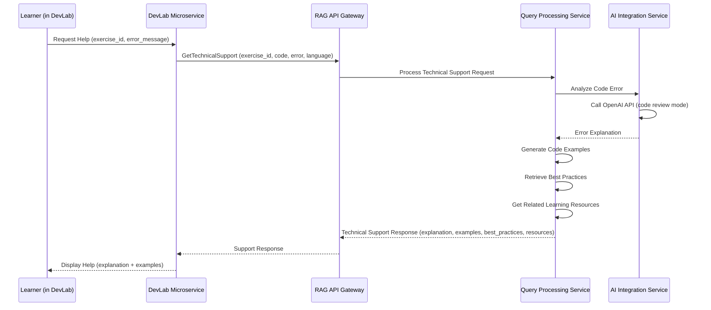
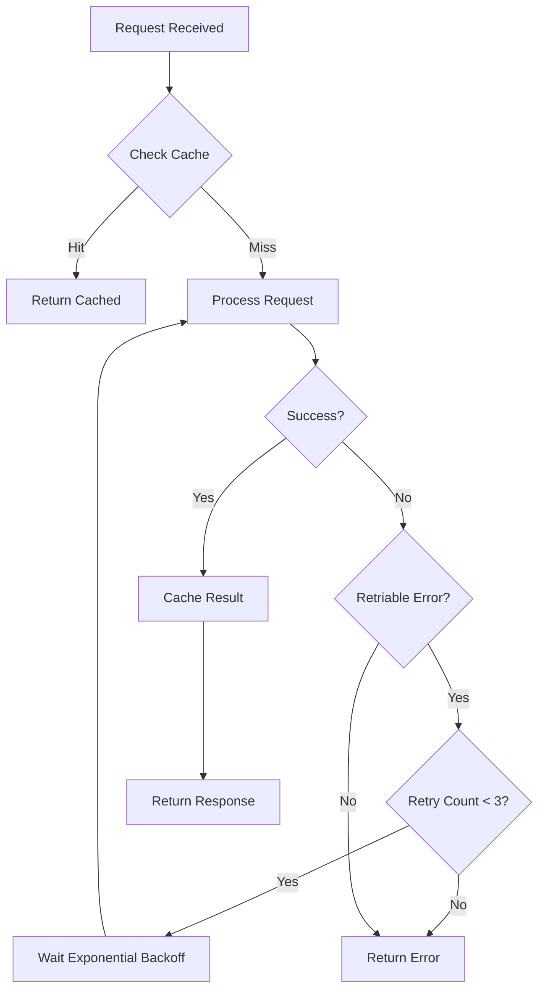

# Stage 03 - Project Flow & Interaction Logic

**Date:** 2025-01-27  
**Project:** EDUCORE - Contextual Assistant (RAG / Knowledge Graph) Microservice

## System Flow Diagrams

### 1. Core Query Processing Flow



### 2. Personalized Query Flow



### 3. Access Control Flow (RBAC + ABAC + Fine-grained)



### 4. Knowledge Graph Sync Flow (Kafka Event-Driven)



### 5. Assessment Support Flow



### 6. DevLab Technical Support Flow



## User Journey Flows

### Persona 1: Learner - Personalized Learning Query

**Flow:**
1. Learner opens chatbot in Course Builder
2. Types: "What should I learn next based on my progress?"
3. System identifies user, retrieves:
   - Role: learner
   - Skill gaps from Skills Engine
   - Learning progress from Learner AI
   - Assessment results
   - DevLab progress
4. System generates personalized response with:
   - Answer tailored to their skill gaps
   - Course recommendations
   - Exercise suggestions
   - Skill gap analysis
5. Learner sees personalized recommendations
6. Learner clicks on a recommended course
7. System tracks interaction in audit log

**Error Paths:**
- User not authenticated → Redirect to login
- No skill gap data → Show general recommendations
- API timeout → Show cached recommendations
- Permission denied → Show error message

### Persona 2: Trainer - Content Discovery

**Flow:**
1. Trainer asks: "Find content about Python for beginners"
2. System checks RBAC (trainer role)
3. System checks ABAC (department, region)
4. System retrieves accessible content
5. System filters by fine-grained permissions
6. System applies field masking (trainers see aggregated data)
7. Trainer receives filtered content list
8. Trainer clicks on content
9. System logs access

**Error Paths:**
- Content restricted → Show: "This content is not available"
- No accessible content → Show: "No content found matching your permissions"
- Cache miss + DB timeout → Retry with exponential backoff

### Persona 3: HR Manager - Analytics Explanation

**Flow:**
1. HR Manager views dashboard with learning metrics
2. Clicks "Explain this metric" on a chart
3. System receives: ExplainAnalytics(metric_id, user_id, role=hr)
4. System checks permissions (HR role, aggregated data only)
5. System retrieves metric explanation
6. System applies field masking (no individual scores)
7. System generates explanation with:
   - Metric meaning
   - Organizational insights
   - Links to related reports
   - Recommendations
8. HR Manager sees explanation
9. System logs access for compliance

**Error Paths:**
- Permission denied → Show: "You don't have access to this metric"
- Metric not found → Show: "Metric not available"
- Graph sync delay → Show: "Data may be outdated"

### Persona 4: API Consumer (Assessment Microservice) - Real-time Hint

**Flow:**
1. Assessment microservice calls GetAssessmentHint
2. System validates mTLS certificate
3. System checks permissions (assessment context)
4. System generates hint (no direct answer)
5. System retrieves related concepts
6. System applies assessment-specific filtering
7. System returns hint response
8. System logs for exam integrity tracking

**Error Paths:**
- mTLS validation fails → Return UNAUTHENTICATED
- Hint generation timeout → Return cached hint
- Rate limit exceeded → Return 429 with retry-after

## State Transitions

### Query Processing State Machine

```
[Idle] 
  ↓ (Query Received)
[Authentication] 
  ↓ (Auth Valid) / ↓ (Auth Invalid → Error)
[Permission Check]
  ↓ (Permission Granted) / ↓ (Permission Denied → Error)
[Cache Check]
  ↓ (Cache Hit → Response) / ↓ (Cache Miss)
[Embedding Generation]
  ↓ (Embedding Ready)
[Vector Search]
  ↓ (Vectors Retrieved)
[Permission Filtering]
  ↓ (Sources Filtered)
[Graph Enrichment]
  ↓ (Context Enriched)
[LLM Generation]
  ↓ (Answer Generated)
[Field Masking]
  ↓ (Response Masked)
[Cache Update]
  ↓ (Cached)
[Response Ready]
```

### Access Control State Machine

```
[Request Received]
  ↓
[Extract User Context] (role, attributes, tenant)
  ↓
[Load RBAC Policies]
  ↓
[Load ABAC Policies]
  ↓
[Load Content Permissions]
  ↓
[Evaluate Policies] (RBAC ∩ ABAC ∩ Content)
  ↓
[Decision] → [Granted] / [Denied]
  ↓ (Granted)        ↓ (Denied)
[Apply Field Masking] [Log Denial]
  ↓
[Log Access]
  ↓
[Return Result]
```

## Error Handling & Retry Logic

### Error Categories

1. **Authentication Errors**
   - UNAUTHENTICATED: Invalid token/certificate
   - **Retry:** No (requires re-authentication)
   - **Action:** Log security event

2. **Authorization Errors**
   - PERMISSION_DENIED: Insufficient permissions
   - **Retry:** No
   - **Action:** Log access attempt, return error

3. **Rate Limiting**
   - RESOURCE_EXHAUSTED: Too many requests
   - **Retry:** Yes (exponential backoff: 1s, 2s, 4s, 8s)
   - **Action:** Return 429 with retry-after header

4. **External API Errors**
   - OpenAI API timeout/error
   - **Retry:** Yes (3 attempts with exponential backoff)
   - **Fallback:** Use cached response if available

5. **Database Errors**
   - Connection timeout
   - **Retry:** Yes (3 attempts)
   - **Fallback:** Serve from cache, log for async sync

6. **Cache Errors**
   - Redis unavailable
   - **Retry:** No
   - **Fallback:** Bypass cache, query DB directly

### Retry Strategy



## Data Flow Diagrams

### Query Request Data Flow

```
Input: QueryRequest
  ├─ query: string
  ├─ tenant_id: string
  ├─ user_id: string
  └─ context: QueryContext

Processing Pipeline:
  1. Authentication → Extract user_id, role, attributes
  2. Permission Evaluation → Filter accessible resources
  3. Query Embedding → Generate vector representation
  4. Vector Search → Retrieve top-K similar content
  5. Permission Filtering → Remove restricted sources
  6. Graph Enrichment → Add knowledge graph context
  7. LLM Generation → Generate answer with context
  8. Field Masking → Apply role-based masking
  9. Response Formatting → Add citations, metadata

Output: QueryResponse
  ├─ answer: string (masked, personalized)
  ├─ confidence: double
  ├─ sources: Source[] (filtered)
  ├─ access_info: AccessControlInfo
  └─ metadata: QueryMetadata
```

### Knowledge Graph Sync Data Flow

```
Input: Kafka Event
  ├─ event_type: "content_update" | "course_update" | "skill_update"
  ├─ entity_id: string
  ├─ changes: ChangeSet
  └─ timestamp: ISO 8601

Processing Pipeline:
  1. Event Consumption → Parse Kafka message
  2. Graph Update → Update knowledge graph in DB
  3. Content Fetch → Fetch updated content from microservice
  4. Embedding Generation → Generate new embeddings
  5. Vector Update → Update vector database
  6. Cache Invalidation → Invalidate related cache entries
  7. Version Update → Update graph version

Output: Sync Complete
  ├─ graph_version: string
  ├─ sync_time: ISO 8601
  └─ data_freshness: < 5 minutes
```

## Summary

- **Total Flows Documented:** 6 system flows, 4 user journeys
- **State Machines:** 2 (Query Processing, Access Control)
- **Error Handling:** 6 error categories with retry strategies
- **Data Flows:** 2 (Query Request, Knowledge Graph Sync)

**Next Steps:**
- Stage 04: Backend (TDD Planning)
- Database schema design
- API implementation planning


