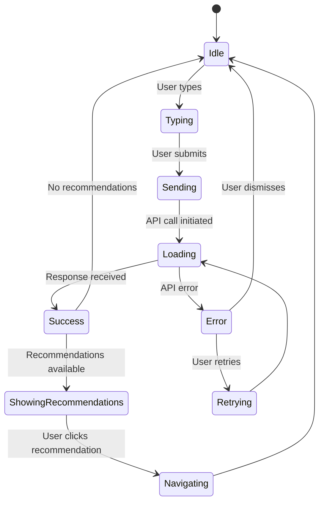

# Stage 05 - UI Flows & Interactions

**Date:** 2025-01-27  
**Project:** EDUCORE - Contextual Assistant (RAG / Knowledge Graph) Microservice

## UI Flow Overview

The **Floating Chat Widget** is embedded in various EDUCORE microservice UIs, providing contextual assistance. The widget floats on the right side of the page and can be toggled open/closed.

### Floating Widget Behavior

```
[Page Load]
  ↓ Widget appears as minimized button (right side)
[User Clicks Button]
  ↓ Widget expands to chat interface
[User Types Query]
  ↓ Input field active
[User Submits]
  ↓ Circular loading spinner appears (for answer generation)
[Answer Generated]
  ↓ Answer formatted into paragraphs (displayed)
[User Closes Widget]
  ↓ Widget minimizes to button
```

---

## Flow 1: Learner - Personalized Learning Query (Floating Widget)

### Screen States

```
[Minimized State] - Floating button on right
  ↓ User clicks button
[Expanded State] - Chat interface opens
  ↓ User types query
[Input State] - Typing in input field
  ↓ User submits (Enter or Send button)
[Loading State] - Circular spinner appears (for answer generation)
  ↓ TypingIndicator shows (interim feedback)
  ↓ API response received
[Response State] - Answer formatted into paragraphs + sources + recommendations
  ↓ User clicks recommendation
[Navigation State] - Redirects to recommended content
```

### Loading States Sequence

1. **User submits query** → Input disabled
2. **TypingIndicator appears** → Shows "Thinking..." or typing dots
3. **Circular LoadingSpinner appears** → Replaces TypingIndicator when answer generation starts
4. **Answer streams/generates** → Spinner visible during generation
5. **Answer received** → Spinner hidden, formatted answer displayed

### Answer Formatting Flow

```
[Raw Answer from API]
  ↓ Check metadata
[Has metadata.blocks[] or metadata.paragraphs[]?]
  ↓ YES: Use metadata structure
  ↓ NO: Client-side paragraphization
[Split into paragraphs] (by \n\n or sentence grouping)
[Format each paragraph] (<p> with max-width, line-height)
[Preserve inline formatting] (bold, italic, links)
[Check for code blocks] (if isCode: true or blocks contain code)
[Render formatted answer] (paragraphs, not monolithic block)
```

### State Machine



### Component States

**FloatingChatWidget:**
- `minimized`: Floating button visible (right side)
- `expanded`: Chat interface open
- `closing`: Animation closing
- `opening`: Animation opening

**ChatInterface:**
- `idle`: Ready for input
- `typing`: User is typing
- `sending`: Query submitted, waiting for API
- `loading`: Circular spinner showing (answer generation)
- `streaming`: Answer is streaming
- `success`: Response received and displayed (formatted)
- `error`: Error occurred
- `retrying`: Retrying after error

**MessageList:**
- `empty`: No messages
- `hasMessages`: Messages displayed
- `scrolling`: Auto-scrolling to latest

**MessageInput:**
- `enabled`: Ready for input
- `disabled`: Disabled during loading
- `error`: Error state (validation)

**LoadingSpinner:**
- `visible`: Showing during answer generation
- `hidden`: Not showing
- `streaming`: Special state for streaming progress

---

## Flow 2: Trainer - Content Discovery

### Screen States

```
[Initial State]
  ↓ Trainer searches for content
[Search Input State]
  ↓ Search submitted
[Loading State]
  ↓ Results received
[Results State] (filtered by permissions)
  ↓ Trainer clicks content
[Content View State] (if permitted)
```

### State Transitions

1. **Search Input**
   - Trainer types search query
   - Input field validates
   - Submit button enabled/disabled

2. **Loading**
   - Loading indicator shown
   - Previous results cleared (optional)
   - Cancel button available

3. **Results**
   - Content items displayed
   - Filtered by permissions
   - Accessible content only
   - "Restricted" indicator for filtered items

4. **Content View**
   - Content details displayed
   - Source link provided
   - Back to search

---

## Flow 3: HR Manager - Analytics Explanation

### Screen States

```
[Analytics Dashboard]
  ↓ HR clicks "Explain this metric"
[Chatbot Widget Opens]
  ↓ Widget requests explanation
[Loading State]
  ↓ Explanation received
[Explanation Display] (with field masking)
  ↓ HR clicks related report link
[Navigation to Report]
```

### State Transitions

1. **Widget Opens**
   - Widget appears (modal or sidebar)
   - Pre-filled query: "Explain [metric_name]"
   - Submit automatically (optional)

2. **Loading**
   - Loading indicator
   - "Analyzing metric..." message

3. **Explanation Display**
   - Explanation text (field-masked)
   - Related report links
   - Key insights
   - "Aggregated data" indicators

4. **Navigation**
   - Click report link
   - Navigate to related report
   - Widget closes or stays open

---

## Flow 4: Assessment Support (Embedded)

### Screen States

```
[Assessment Question]
  ↓ Learner clicks "Get Hint"
[Chatbot Widget Opens]
  ↓ Hint request sent
[Loading State]
  ↓ Hint received
[Hint Display] (no direct answer)
  ↓ Learner clicks related concept
[Concept View]
```

### State Transitions

1. **Widget Opens**
   - Widget appears in assessment context
   - Pre-filled: "Help with this question"
   - Submit automatically

2. **Loading**
   - "Generating hint..." message
   - Integrity indicator (hint tracked)

3. **Hint Display**
   - Hint text (no direct answer)
   - Related concepts listed
   - Related content links
   - "Hint provided" logged

4. **Concept View**
   - Concept explanation
   - Related learning content
   - Back to hint

---

## Flow 5: DevLab Technical Support (Embedded)

### Screen States

```
[DevLab Exercise]
  ↓ Learner gets error
  ↓ Learner clicks "Get Help"
[Chatbot Widget Opens]
  ↓ Help request sent
[Loading State]
  ↓ Help received
[Technical Support Display] (explanation + code examples)
  ↓ Learner clicks code example
[Code Example View]
```

### State Transitions

1. **Widget Opens**
   - Widget appears in DevLab context
   - Error message pre-filled
   - Code context included (optional)

2. **Loading**
   - "Analyzing code..." message
   - Loading indicator

3. **Support Display**
   - Error explanation
   - Code examples
   - Best practices
   - Related resources

4. **Code Example View**
   - Full code example
   - Syntax highlighting
   - Copy button
   - Explanation

---

## Floating Widget Toggle Flow

### Toggle Behavior

```
[Minimized State]
  - Floating button on right side (fixed position)
  - Button shows chat icon
  - Clicking opens widget
  ↓ User clicks button
[Expanding Animation]
  - Smooth slide-in from right
  - Widget expands to chat interface
  - Height: ~600px (desktop), full screen (mobile)
[Expanded State]
  - Chat interface visible
  - Header with close button
  - Message list, input field visible
  ↓ User clicks close button
[Closing Animation]
  - Smooth slide-out to right
  - Widget minimizes to button
[Minimized State]
  - Back to floating button
```

### Mobile Behavior
- **< 768px:** Widget expands to full screen when opened
- **> 768px:** Widget expands as side panel (right side)

---

## Answer Rendering Flow

### Answer Formatting Process

```
[Backend Response]
{
  answer: "This is paragraph one.\n\nThis is paragraph two with **bold** text.",
  metadata: {
    blocks: [...] OR paragraphs: [...] OR isCode: true
  }
}
  ↓
[Check Metadata]
  - Has metadata.blocks[]? → Use blocks structure
  - Has metadata.paragraphs[]? → Use paragraphs structure
  - Has metadata.isCode === true? → Format as code block
  ↓
[Client-Side Fallback] (if no metadata)
  - Split by double line breaks (\n\n)
  - Or group sentences (max 3-4 per paragraph)
  ↓
[Format Each Paragraph]
  - Wrap in <p> element
  - Max width: 65-75ch
  - Line height: 1.6-1.8
  - Proper spacing between paragraphs
  ↓
[Preserve Inline Formatting]
  - **bold** → <strong>
  - *italic* → <em>
  - Links → <a>
  ↓
[Check for Code Blocks]
  - If isCode: true → Render as <pre><code>
  - If blocks contain code → Render code blocks
  ↓
[Render Formatted Answer]
  - NOT monolithic block
  - Paragraphs with proper spacing
  - Readable and scannable
```

### Code Block Handling

```
[Backend Marks as Code]
{
  content: "...",
  isCode: true,
  language: "javascript"
}
  ↓
[Render Code Block]
  - <pre><code> wrapper
  - Syntax highlighting (if language provided)
  - Copy button (optional)
  - Proper styling
```

---

## Error Handling Flows

### Error States

**1. Network Error**
```
[Loading State]
  ↓ Network timeout/error
[Error Toast Appears]
  - Position: Top-right or bottom-right
  - Message: "Network error. Please check your connection."
  - Retry button visible
  ↓ User clicks retry
[Retry Loading State] (retry)
```

**2. API Error**
```
[API Call]
  ↓ API returns error
[Error Toast Appears]
  - Error message from API
  - Retry button
  - Auto-dismiss after 5 seconds
```

**3. Permission Denied**
```
[Query Submitted]
  ↓ Permission check fails
[Error Toast Appears]
  - Message: "You don't have access to this content"
  - No retry (permission issue)
```

**4. Rate Limit**
```
[Query Submitted]
  ↓ Rate limit exceeded
[Error Toast Appears]
  - Message: "Too many requests. Please wait..."
  - Retry button (with delay indicator)
  - Auto-retry after delay (optional)
```

**5. Validation Error**
```
[User Types Query]
  ↓ Invalid input (e.g., empty)
[Input Field Error State]
  - Error message in input field
  - Submit button disabled
  ↓ User fixes input
[Back to Input State]
```

**2. Permission Denied**
```
[Query Submitted]
  ↓ Permission check fails
[Permission Error State]
  ↓ User sees: "You don't have access to this content"
[Dismiss]
  ↓ Back to Idle
```

**3. Rate Limit**
```
[Query Submitted]
  ↓ Rate limit exceeded
[Rate Limit Error State]
  ↓ User sees: "Too many requests. Please wait..."
[Auto-retry] (after delay)
  ↓ Or manual retry
```

**4. Validation Error**
```
[User Types Query]
  ↓ Invalid input (e.g., empty)
[Validation Error State]
  ↓ Error message in input field
[User Fixes Input]
  ↓ Back to Typing
```

---

## Loading States

### Loading Indicators

**1. Typing Indicator (Interim Feedback)**
- Animated dots (...)
- Shows immediately after query submission
- Message: "Thinking..." or typing animation
- Position: Below last message (left-aligned)
- Duration: Until answer generation starts

**2. Circular Loading Spinner (Answer Generation)**
- **Material-UI CircularProgress** component
- Shows when answer generation/streaming starts
- Replaces TypingIndicator
- Position: In message bubble area (where answer will appear)
- Message: "Generating answer..." (optional)
- Size: Medium (adjustable)
- Duration: Until answer is received

**3. Streaming Progress** (if supported)
- Circular spinner with progress indicator
- Shows streaming progress
- Updates as answer streams

**4. Recommendations Loading**
- Spinner animation
- Message: "Finding personalized recommendations..."
- Shows after answer is displayed

---

## Interaction Patterns

### 1. Widget Toggle
- **Minimized Button:** Click to open widget
- **Close Button (Header):** Click to minimize widget
- **Escape Key:** Close widget (when open)
- **Click Outside:** Close widget (optional, configurable)
- **Animation:** Smooth slide-in/slide-out

### 2. Message Sending
- **Enter Key:** Submit query
- **Shift+Enter:** New line
- **Submit Button:** Submit query (Material-UI Button with icon)
- **Character Limit:** Show remaining (if applicable)
- **Input Validation:** Disable submit if empty

### 3. Theme Toggle
- **Theme Toggle Button:** In ChatHeader
- **Toggle:** Light ↔ Dark
- **Persistent:** Saves preference (localStorage)
- **Material-UI Theme:** Switches between light/dark themes

### 2. Message Display
- **Auto-scroll:** Scroll to latest message
- **Source Expansion:** Click to expand/collapse sources
- **Recommendation Click:** Navigate to content
- **Timestamp:** Show relative time (e.g., "2 minutes ago")

### 3. Error Handling (Toast Notifications)
- **Toast Display:** Material-UI Snackbar
- **Position:** Top-right or bottom-right
- **Error Message:** User-friendly message
- **Retry Button:** Retry last query (if applicable)
- **Dismiss Button:** Close toast
- **Auto-dismiss:** Auto-dismiss after 5 seconds (configurable)
- **Stack Multiple:** Multiple toasts can stack
- **Accessibility:** ARIA labels and announcements

### 4. Accessibility
- **Keyboard Navigation:** Tab through all interactive elements
- **Screen Reader:** Announce messages and errors
- **Focus Management:** Focus on input after message sent
- **ARIA Labels:** All buttons and inputs labeled

---

## Responsive Behavior

### Mobile (< 768px)
- **Minimized:** Floating button on right (bottom-right on mobile)
- **Expanded:** Full screen overlay
- **Messages:** Compact view, optimized for mobile
- **Input:** Bottom-fixed, touch-friendly
- **Sources:** Collapsed by default, expandable
- **Theme Toggle:** Accessible in header
- **Close Button:** Large, touch-friendly

### Tablet (768px - 1024px)
- **Minimized:** Floating button on right
- **Expanded:** Side panel (width: ~400px)
- **Messages:** Standard view
- **Input:** Bottom of widget
- **Sources:** Expandable
- **Height:** ~600px (adjustable)

### Desktop (> 1024px)
- **Minimized:** Floating button on right (fixed position)
- **Expanded:** Side panel (width: ~450px)
- **Messages:** Full view with proper spacing
- **Input:** Bottom of widget
- **Sources:** Expandable, good spacing
- **Height:** ~600px (adjustable)
- **Position:** Right side, fixed

---

## State Management Flow

### Message Flow
```
User Input
  ↓
Add User Message to State
  ↓
Set Loading State
  ↓
API Call
  ↓
Success: Add Assistant Message
  ↓
Update UI with Response
  ↓
Clear Loading State
```

### Error Flow
```
API Call
  ↓
Error Occurred
  ↓
Set Error State
  ↓
Display Error Message
  ↓
User Action (Retry/Dismiss)
  ↓
Clear Error State
```

---

## Acceptance Criteria Mapping

### US-001: Contextual Query Processing
- ✅ User can type and submit query
- ✅ Response displayed within 3 seconds
- ✅ Sources displayed with citations
- ✅ Confidence score shown (optional)

### US-013: Personalized Query Responses
- ✅ Personalized recommendations displayed
- ✅ Skill gap analysis shown
- ✅ Recommendations clickable

### US-003: Assessment Support
- ✅ Hint displayed without revealing answer
- ✅ Related concepts shown
- ✅ Audit trail logged

### US-004: DevLab Support
- ✅ Error explanation displayed
- ✅ Code examples shown
- ✅ Best practices listed

---

## Real-time Updates Flow (Supabase)

### Realtime Subscription

```
[Widget Opens]
  ↓
[Initialize Supabase Realtime]
  ↓
[Subscribe to Channel]
  - Channel: 'chat-messages'
  - Events: 'INSERT', 'UPDATE'
  ↓
[Receive Real-time Update]
  ↓
[Update Redux Store]
  - Dispatch action to chat.slice
  ↓
[UI Updates]
  - New message appears
  - Message list re-renders
  - Auto-scroll to latest
```

### Connection Status

```
[Connected] - Realtime active
  ↓ Connection lost
[Disconnected] - Show indicator (optional)
  ↓ Reconnecting
[Reconnecting] - Auto-reconnect
  ↓ Reconnected
[Connected] - Back online
```

---

## Summary

### UI Flows Documented
- **Floating Widget Toggle** - Minimized/expanded behavior
- **5 main user flows** (Learner, Trainer, HR, Assessment, DevLab)
- **Answer Formatting Flow** - Paragraph-based rendering
- **Loading States** - TypingIndicator + Circular Spinner
- **Error Handling** - Toast notifications with retry
- **Real-time Updates** - Supabase subscriptions
- **Responsive Behavior** - Mobile/Tablet/Desktop

### Component States
- **FloatingChatWidget:** minimized, expanded, opening, closing
- **ChatInterface:** idle, typing, sending, loading, streaming, success, error
- **LoadingSpinner:** visible, hidden, streaming
- **State transitions** mapped with animations

### Interaction Patterns
- Widget toggle (button click, close button, Escape key)
- Message sending (Enter, Shift+Enter, Submit button)
- Theme toggle (Light/Dark)
- Error handling (Toast notifications)
- Real-time updates (Supabase subscriptions)

### Key Features
- ✅ Floating widget on right side
- ✅ Toggle open/close with animations
- ✅ Circular loading spinner for answers
- ✅ Answer reformatting into paragraphs
- ✅ Toast notifications for errors
- ✅ Material-UI with Light/Dark themes
- ✅ Mobile-first responsive design

---

**Next:** Frontend TDD Plan

